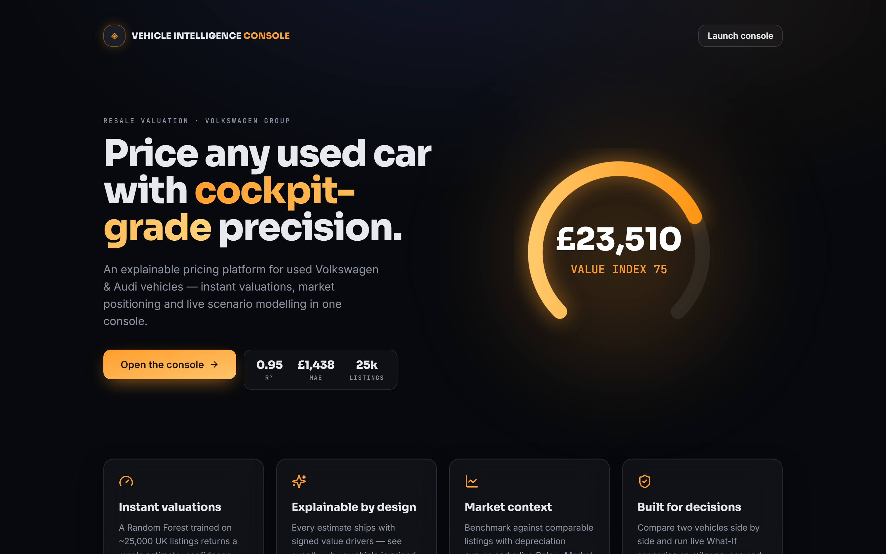
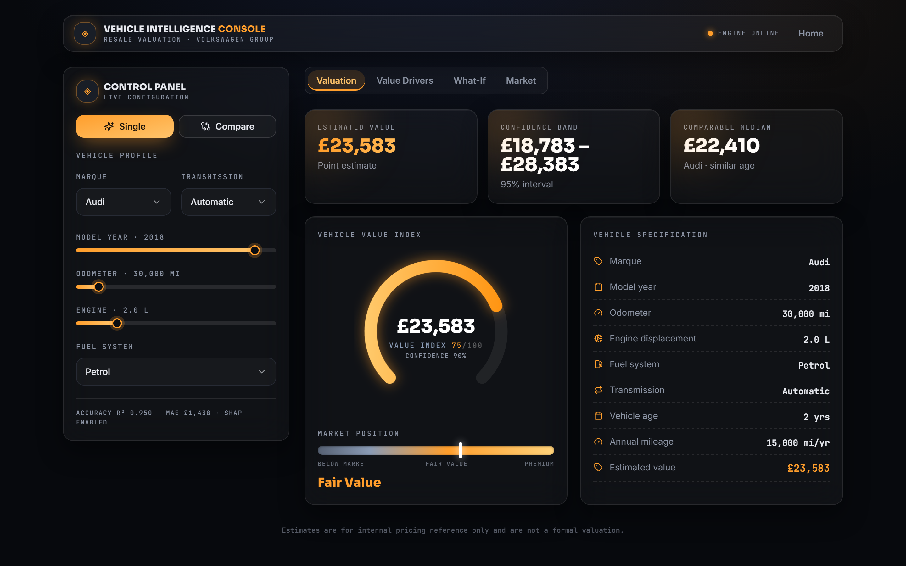
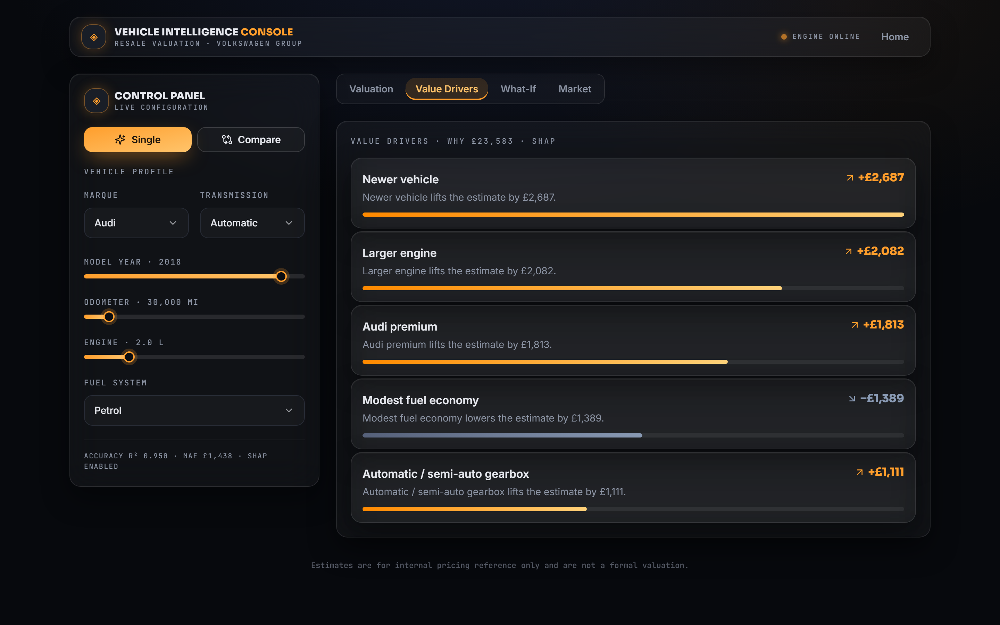

# 🚘 Vehicle Intelligence Console

> A production-grade, explainable resale-valuation platform for used Volkswagen & Audi vehicles. **Next.js 15 + TypeScript** frontend (deploy to Vercel) talking to a **FastAPI + scikit-learn + SHAP** backend (deploy to Railway / Render).

<p align="left">
  
  
  
  
  
</p>

---

## Screenshots

| Landing | Console | Value drivers (SHAP) |
|---|---|---|
|  |  |  |

---

## What it does

- **Instant valuation** of a used VW/Audi from six attributes, with a 95% confidence band and a 0–100 **Value Index**.
- **SHAP explanations** — signed, plain-English value drivers for every estimate.
- **Market positioning** — Below Market / Fair Value / Premium versus comparable listings, plus depreciation and price-vs-mileage charts.
- **Comparison mode** — two vehicles side by side with a valuation gap.
- **What-If simulator** — adjust mileage, age and engine for an instant live re-valuation.
- **Premium automotive UI** — dark graphite / metallic silver / amber, animated gauge and meters (Framer Motion), shadcn/ui components.

The Random Forest reproduces the original results: **R² = 0.9504, MAE = £1,438** (vs Linear Regression R² = 0.8328).

---

## Architecture

```
┌─────────────────────────────┐         HTTPS / JSON        ┌──────────────────────────────┐
│  Next.js 15 (Vercel)        │  ───────────────────────▶   │  FastAPI (Railway / Render)   │
│  • App Router, TypeScript   │   /api/predict              │  • scikit-learn Random Forest │
│  • TailwindCSS + shadcn/ui  │   /api/explain              │  • SHAP explanations          │
│  • Framer Motion            │   /api/compare              │  • pandas market analytics    │
│  • Recharts                 │   /api/meta                 │  • random_forest.pkl (joblib) │
└─────────────────────────────┘                             └──────────────────────────────┘
```

The frontend is fully static/serverless-friendly; all ML (model + SHAP, which need scipy/numba) lives on a full-container host, so neither side hits a size limit.

---

## Repository structure

```
.
├── backend/                      # FastAPI service (deploy to Railway / Render)
│   ├── api/
│   │   ├── main.py               # FastAPI app, CORS, routes
│   │   ├── inference.py          # valuation, market position, explanations
│   │   └── schemas.py            # Pydantic request/response models
│   ├── src/                      # reusable ML package (preprocessing, features, …)
│   ├── models/random_forest.pkl  # trained model + model_metadata.json
│   ├── data/{vw,audi}.csv        # reference dataset
│   ├── train.py                  # retrain + regenerate artifacts
│   ├── requirements.txt          # fastapi, uvicorn, scikit-learn, shap, …
│   ├── Dockerfile · Procfile · railway.json · runtime.txt
│   └── .env.example
├── frontend/                     # Next.js 15 app (deploy to Vercel)
│   ├── app/                      # / (landing) · /console (dashboard)
│   ├── components/ui/            # shadcn/ui primitives
│   ├── components/console/       # gauge, meter, spec sheet, drivers, charts
│   ├── lib/{api,types,utils}.ts  # typed API client + shared types
│   └── .env.example
├── render.yaml                   # Render Blueprint (backend)
├── docs/                         # screenshots
└── notebooks/                    # original EDA / modelling notebooks
```

---

## REST API

| Method | Route | Body | Returns |
|---|---|---|---|
| `GET` | `/health` | — | liveness |
| `GET` | `/api/meta` | — | categories, ranges, metrics, depreciation & scatter data |
| `POST` | `/api/predict` | `VehicleInput` | price, band, confidence, value index, market position |
| `POST` | `/api/explain` | `VehicleInput` | prediction **+ ranked SHAP value drivers** |
| `POST` | `/api/compare` | `{vehicleA, vehicleB}` | both valuations + gap + winner |

`VehicleInput`: `{ brand, year, mileage, engineSize, fuelType, transmission }`. Interactive docs at `/docs` (Swagger).

---

## Local development

### 1. Backend (FastAPI)

```bash
cd backend
python -m venv .venv && source .venv/bin/activate   # Windows: .venv\Scripts\activate
pip install -r requirements.txt
uvicorn api.main:app --reload --port 8000
# → http://127.0.0.1:8000/docs
```

### 2. Frontend (Next.js)

```bash
cd frontend
npm install
cp .env.example .env.local            # NEXT_PUBLIC_API_URL=http://127.0.0.1:8000
npm run dev
# → http://localhost:3000
```

---

## Deployment

### Backend → Railway or Render

The backend deploys **from the repository root** — no custom root directory needed. Root-level [`requirements.txt`](requirements.txt), [`Procfile`](Procfile), [`runtime.txt`](runtime.txt) and [`railway.json`](railway.json) pull in `backend/` and start the app with `--app-dir backend`.

**Render (Blueprint):** push the repo, then *New → Blueprint* and select it ([`render.yaml`](render.yaml)). Set `FRONTEND_ORIGIN` to your Vercel URL.

**Railway:** *New Project → Deploy from repo* (leave root directory as the repo root). Nixpacks installs `requirements.txt` and reads [`railway.json`](railway.json) for the start command. Add `FRONTEND_ORIGIN`.

**Docker (any host):** `docker build -t viapi backend && docker run -p 8000:8000 viapi`.

Start command (root): `uvicorn api.main:app --app-dir backend --host 0.0.0.0 --port $PORT` · health check: `/health`.

### Frontend → Vercel

1. *Add New Project* → import the repo.
2. Set **Root Directory** to `frontend`.
3. Add env var **`NEXT_PUBLIC_API_URL`** = your backend URL (e.g. `https://your-api.onrender.com`).
4. Deploy (Next.js is auto-detected; build `next build`).

> `NEXT_PUBLIC_API_URL` is inlined at build time — set it in Vercel **before** building, and redeploy if you change the backend URL.

---

## Environment variables

| Where | Variable | Example |
|---|---|---|
| Backend | `FRONTEND_ORIGIN` | `https://your-app.vercel.app` (CORS allow-list; `*` in dev) |
| Backend | `PORT` | injected by host |
| Frontend | `NEXT_PUBLIC_API_URL` | `https://your-api.onrender.com` |

---

## Model

- **Random Forest** (`scikit-learn 1.7`), 100 trees, trained on ~25,700 cleaned UK listings.
- Features: `mileage`, `engineSize`, `car_age`, `mileage_per_year`, road `tax`, `mpg`, plus one-hot `transmission` / `fuelType` / `brand`.
- Retrain & regenerate artifacts: `cd backend && pip install -r requirements-dev.txt && python train.py`.
- **Results:** R² = 0.9504 · MAE = £1,438 · RMSE = £2,218.

---

## Future improvements

- Gradient boosting (XGBoost / LightGBM) benchmark and tuned RF.
- Conformal prediction intervals instead of the tree-spread heuristic.
- Auth + rate limiting on the API; response caching.
- More brands and a refreshed, current-year dataset.

---

## Disclaimer

Educational project. *Volkswagen* and *Audi* are trademarks of **Volkswagen AG**; this is an independent tool, not affiliated with or endorsed by VW AG. Estimates are statistical and not a formal valuation.
